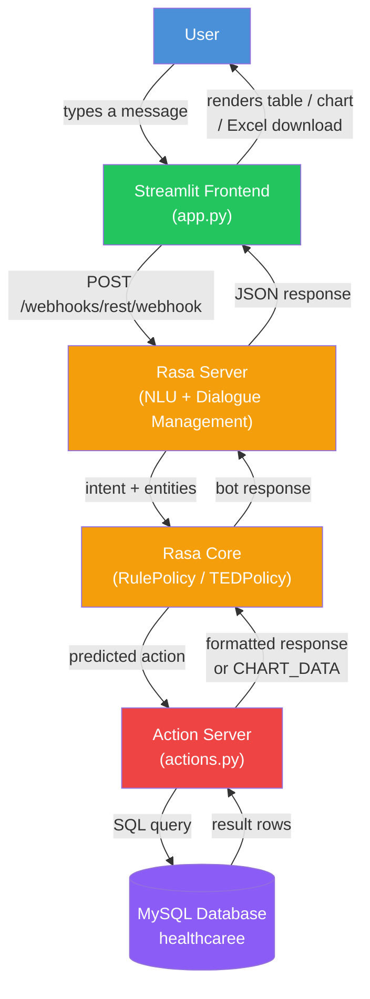

# Healthcare Assistant — Rasa Chatbot

An AI-powered healthcare chatbot built with **Rasa 3.6.21**, backed by a **MySQL** patient database, with a **Streamlit** chat frontend. Supports natural language queries about patients — filtering by gender, blood group, medical condition, admission type, and more — along with follow-up context memory and Plotly-based data visualizations.

## Features

- **Natural language patient queries** — count, list, and filter patients by gender, blood type, medical condition, admission type, medication, and test results
- **Follow-up context memory** — supports short follow-up queries (e.g. "what about female?", "only B+") that refine a previous query without restating all filters
- **Fuzzy matching** — uses RapidFuzz to handle typos and informal phrasing (e.g. "femsle" → "female")
- **Patient lookup by name** — retrieves specific patient details (doctor, hospital, medication, test results)
- **Analytics queries** — most common blood type/disease, oldest/youngest patient, top billing, doctor/hospital comparisons
- **Data visualization** — Plotly charts (bar, pie, line) for blood group and gender distributions, rendered directly in the chat
- **Excel export** — download full filtered results as an `.xlsx` file
- **Custom actions** — Python backend (`actions.py`) handles all MySQL querying and business logic

## Tech Stack

| Layer | Technology |
|---|---|
| NLU / Dialogue Management | Rasa 3.6.21 (DIETClassifier, TEDPolicy, RulePolicy) |
| Custom Actions | Rasa SDK, Python |
| Database | MySQL (55,500-row patient dataset) |
| Frontend | Streamlit |
| Fuzzy Matching | RapidFuzz |
| Visualization | Plotly |
| Excel Export | openpyxl |

## Architecture



**Flow summary:**
1. User types a query in the Streamlit chat UI
2. Streamlit sends it to the Rasa server's REST webhook (port 5005)
3. Rasa's NLU pipeline classifies the intent and extracts entities (gender, blood type, condition, etc.)
4. Rasa Core predicts the next action based on trained stories/rules
5. The action server (port 5055) executes the corresponding Python action, querying MySQL directly
6. Results are formatted as text, a data table, or chart JSON and sent back through Rasa to Streamlit
7. Streamlit renders the response — a table, a Plotly chart, or plain text — with an optional Excel download button

## Project Structure

```
HealthcareBot/
├── actions/
│   ├── __init__.py
│   └── actions.py          # Custom actions: DB queries, filters, chart data, fuzzy matching
├── data/
│   ├── nlu.yml              # Training examples for intents and entities
│   ├── stories.yml          # Conversation flow training data
│   └── rules.yml            # Fixed conversation rules
├── tests/
│   └── test_stories.yml
├── app.py                   # Streamlit frontend
├── config.yml                # NLU pipeline + policy configuration
├── domain.yml                 # Intents, entities, slots, responses, actions
├── credentials.yml
├── endpoints.yml
└── requirements.txt
```

## Setup

**1. Create and activate a virtual environment (Python 3.10 required):**
```bash
py -3.10 -m venv venv
venv\Scripts\activate      # Windows
```

**2. Install dependencies:**
```bash
pip install -r requirements.txt
```

**3. Set your database password as an environment variable** (do this in every terminal before running the app or action server):
```bash
set DB_PASSWORD=your_mysql_password
```

**4. Train the model:**
```bash
rasa train
```

**5. Run the system — three terminals, each with the venv activated:**

Terminal 1 — Rasa server:
```bash
rasa run --enable-api --cors "*"
```

Terminal 2 — Action server:
```bash
rasa run actions
```

Terminal 3 — Streamlit frontend:
```bash
streamlit run app.py
```

Then open `http://localhost:8501` in your browser.

## Known Limitations

- **No unfiltered total-count queries** — the bot requires at least one filter (gender, blood type, condition, etc.) before returning a count; a fully unfiltered "how many patients in total" is intentionally not supported.
- **Patient name lookup relies on exact/near-exact matching** — free-form or misspelled names may not be recognized, since the pipeline has no pretrained language model for general name recognition.
- **Entity extraction for compound values** (e.g. blood types like "A+") can occasionally misalign with tokenizer boundaries, which may affect edge-case queries.
- **Short follow-up queries** work for common filter refinements (gender, blood type, condition) but are not guaranteed for every possible phrasing.

## Author

**Akansha Kashyap**
GitHub: [Akansha-695](https://github.com/Akansha-695)

## License

This project was built as part of an academic/internship exercise.
